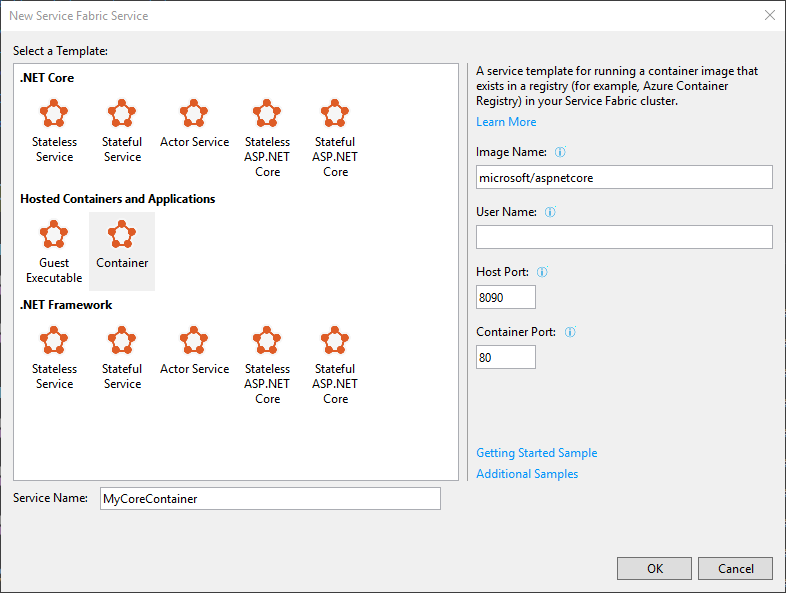

# Service Fabric Windows Container Quickstart

> NOTE: Container application cannot run on the development cluster on your local machine.

## Task 1 - Create a New Service Fabric Application

- Run Visual Studio as Administrator
- Create a Service Fabric application
- Choose the **Container** template
- Type **** for the ImageName
- Leave the User Name field empty
- Enter **8090** for the Host Port - this is the port that service fabric will use to host your service
- Enter **80** from the Container Port - this is the port that your container is serving
- For Service Name, supply a name (i.e. **MyContainerService**)

  

## Task 2 - Open the New Project in Visual Studio

- Run Visual Studio in Administrative mode
- Right-click on the project, and Publish...

## Task 3 - Deploy to Your Service Fabric Cluster in Azure

