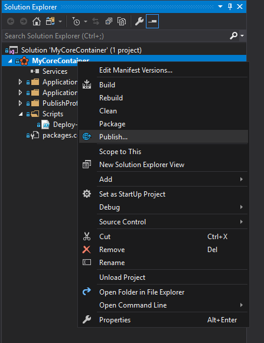
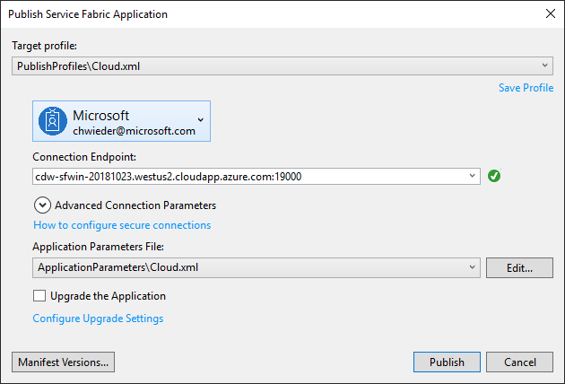

# Service Fabric Windows Container Quickstart

> NOTE: Container application cannot run on the development cluster on your local machine.

## Task 1 - Create a New Service Fabric Application

- Run Visual Studio as Administrator
- Create a Service Fabric application
- Choose the **Container** template
- Type **[microsoft/dotnet-samples:aspnetapp](https://hub.docker.com/r/microsoft/dotnet-samples/)** for the ImageName
- Leave the User Name field empty
- Enter **8090** for the Host Port - this is the port that service fabric will use to host your service
- Enter **80** from the Container Port - this is the port that your container is serving
- For Service Name, supply a name (i.e. **MyContainerService**)

  

## Task 2 - Open the New Project in Visual Studio

- Run Visual Studio in Administrative mode
- Right-click on the project, and Publish...

  

- Pick your Azure cluster and publish using the Cloud.xml settings

  

## Task 3 - Allow Access via Load Balancer

- Setup load balancing probe (HTTP/8090)
- Setup load balancing port (TCP/8090)

## Task 4 - Browse and Test Application

- Browse http://**YOUR_CLUSTER**.**westus2**.cloudapp.azure.com:8090 (confirm your cluster name and region)